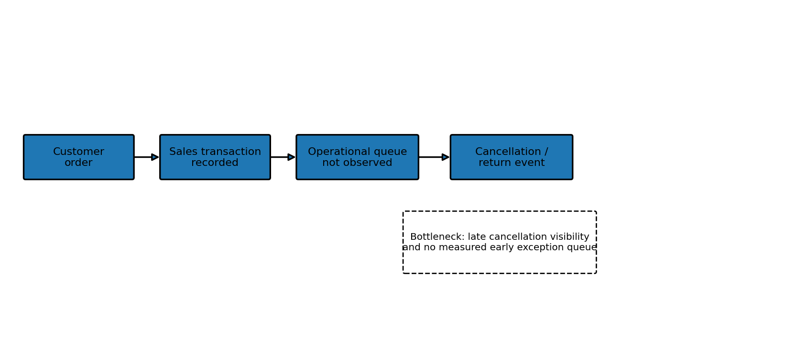
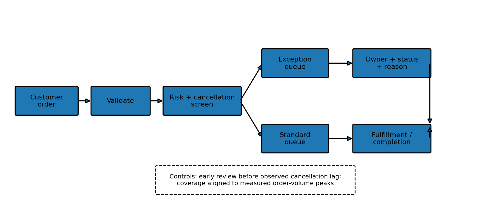

# Order IQ: E-commerce Order Cancellation Analysis and Exception Workflow 📦

> **Operations problem:** e-commerce teams can see orders, cancellations and demand patterns after the fact, but without a structured exception workflow they may review risky orders too late or spend review capacity uniformly. **Order IQ** turns historical transaction data into measured cancellation insights, a risk-ranked exception queue, and a proposed review workflow.

**Live demo:** `https://YOUR-ORDER-IQ.streamlit.app` *(replace after deployment)*

**Dataset:** UCI Online Retail, 541,909 transaction lines covering 1 Dec 2010–9 Dec 2011. UCI documents `C`-prefixed invoice numbers as cancellation records. citeturn2search0

## Findings and recommendations

The app generates these findings dynamically from the real UCI data. **Do not copy demo-mode values into a resume.** The release package deliberately does not invent real metrics because the 22.6 MB UCI workbook must be fetched in the deployment/runtime environment.

| Finding | Action |
|---|---|
| Matched cancellation rate | Use it as a lower-bound cancellation signal and focus review capacity on orders with the highest predicted risk. |
| Median cancellation lag | Set the initial exception-review window around the observed lag, then validate against a live operational SLA. |
| Product hotspots | Investigate high-rate products only after applying the minimum-volume filter; review product-specific cancellation causes. |
| Peak order hour / weekday | Align exception-review and warehouse support coverage with measured order-load peaks. |
| Top-decile model performance | Use the pilot-impact table to decide whether a 10% review queue captures enough cancellations to justify operational review cost. |

## Process change

### As-is



### To-be



The to-be workflow adds two explicit controls that are absent from the transaction history: **early exception screening** and **risk-based review**. The dataset does not contain inventory, payment or warehouse completion timestamps, so those stages are proposed controls rather than measured historical facts.

## Screenshots

Add screenshots from the deployed **real-data** app before publishing the project:

```text
screenshots/
├── executive-dashboard.png
├── findings-process.png
├── ml-risk.png
└── exceptions-tracker.png
```

> **Demo-mode warning:** the repository includes synthetic data for offline testing. Demo-mode cancellation/model metrics are illustrative only and must not be used as resume evidence.

## What the system does

1. Loads UCI data using `ucimlrepo.data.ids + data.features` and validates `InvoiceNo` before processing.
2. Separates genuine positive sales, `C`-invoice cancellation records and negative non-C returns/adjustments.
3. Matches cancellation lines to likely earlier positive orders using identified customer, product, earlier date and exact quantity.
4. Reports **Matched cancellation rate**, explicitly as a lower bound because anonymous, unmatched and partial-quantity cases are excluded.
5. Gives anonymous orders `IsAnonymous=True` and zero customer history rather than grouping all anonymous customers together.
6. Adds leakage-safe `PriorOrders`, `PriorRevenue`, `PriorCancellations` and `PriorCancellationRate`.
7. Measures cancellation lag, repeat-purchase gaps, hourly and weekday order load.
8. Uses Isolation Forest for outcome-free anomaly detection.
9. Uses a chronological Random Forest cancellation model on identified customers only; the last 28 days are censored from evaluation to reduce right-censoring.
10. Reports top-decile precision/recall, PR-AUC, ROC-AUC and lift against the cancellation base rate.
11. Converts model predictions into a **pilot impact table**: if operations reviews the riskiest 5/10/20/30% of orders, how many cancellations are caught and how many reviews are required per catch.
12. Provides an **exceptions tracker** with owner, status and reason, downloadable as CSV.
13. Provides a country selector in the order simulator and reuses fitted models/reference distributions rather than refitting on each click.

## ML and operations logic

### Isolation Forest

The anomaly model is trained on genuine positive sales orders only. Cancellation/return outcomes are never fed into the anomaly score.

### Cancellation model

A Random Forest estimates cancellation probability from information available at order time: order value, basket size, customer history, prior cancellation history, hour, weekday and country. The headline evaluation uses a chronological split and no arbitrary 0.5 threshold.

### Pilot impact

The operational question is:

> **If the team reviews the riskiest 10% of orders, what percentage of observed cancellations would be caught, and how many reviews are needed per cancellation caught?**

This is back-testing on historical data, not proof of future operational performance.

## Currency

The source dataset is in GBP. Order IQ keeps GBP internally and may show INR using a clearly labelled fixed presentation reference. This is cosmetic and **not** a 2010–11 historical purchasing-power conversion.

## Limitations

- UCI has no inventory levels, payment events, warehouse queue timestamps or fulfillment completion timestamps; the proposed workflow cannot claim to predict fulfillment performance.
- Cancellation matching is heuristic and exact-quantity based, so matched cancellation rate is a lower bound.
- Anonymous orders cannot be reliably linked to customer-level cancellation outcomes and are excluded from supervised model evaluation.
- The last 28 days are censored from supervised evaluation because their cancellation outcomes may not yet be fully observed.
- Historical 2010–11 results describe this dataset and should not be presented as current e-commerce benchmarks.

## Local run

```bash
python3 -m venv .venv
source .venv/bin/activate
pip install -r requirements.txt
streamlit run app.py
```

For development/testing:

```bash
pip install -r requirements-dev.txt
pytest -q
```

To generate the real-data metrics report locally after the UCI dataset is available:

```bash
python scripts/run_real_report.py
```

The script intentionally fails if the loader falls back to synthetic data, preventing accidental publication of demo metrics.

## Deployment

Streamlit Community Cloud deploys from a GitHub repository by selecting the repository, branch and `app.py` entrypoint. urlStreamlit Community Cloud deployment guidehttps://docs.streamlit.io/deploy/streamlit-community-cloud/deploy-your-app/deploy

After deployment, replace the placeholder live URL and add 3–4 screenshots from the real-data app.

## Dataset citation

Chen, D. (2015). **Online Retail**. UCI Machine Learning Repository. https://doi.org/10.24432/C5BW33
